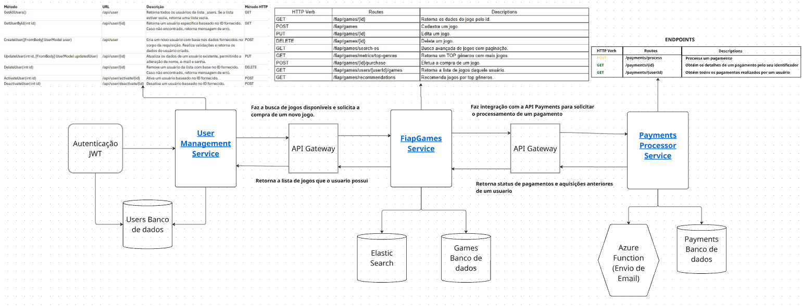

# PaymentsProcessorService
Microserviço responsável pelo processamento de pagamentos, oferecendo integração, segurança e escalabilidade.

# Fluxo de Comunicação entre Microsserviços
 Microsserviços envolvidos:
- Users: Gerencia dados de usuários (cadastro, autenticação, perfil).
- Games: Gerencia jogos que o usuário possue em sua biblioteca.
- Payments: Gerencia pagamentos/compras de jogos.

# Comunicação entre os Microsserviços
Diagrama de sequencia

    participante Usuários
    participante Jogos
    participante Pagamentos

    Usuários->>Jogos: Solicita a compra de um novo jogo (com dados do usuário)
    Jogos->>Pagamentos: Solicita o processamento do pagamento
    Pagamentos-->>Jogos: Retorna status da transação
    Jogos-->>Usuários: Retorna se o jogo foi adquirido com sucesso.

# Detalhamento das Integrações
1. Usuários → Jogos
- Faz a busca de jogos disponiveis e solicita a compra de um novo jogo.
2. Jogos → Pagamentos
- Faz integração com a API Payments para solicitar o processamento de um pagamento.
- Retorna status de pagamentos e aquisições anteriores de um usuario.
3. Jogos → Usuários
- Retorna a lista de jogos que o usuario possui.

# Tecnologias comuns para integração
- REST APIs.
- Api gateway para garantir a segurança na comunicação entre os microserviços.

# Desenho de arquitetura representando o fluxo de funcionamento

# URL Miro
https://miro.com/app/board/uXjVJJtlGm4=/?focusWidget=3458764640045890262

